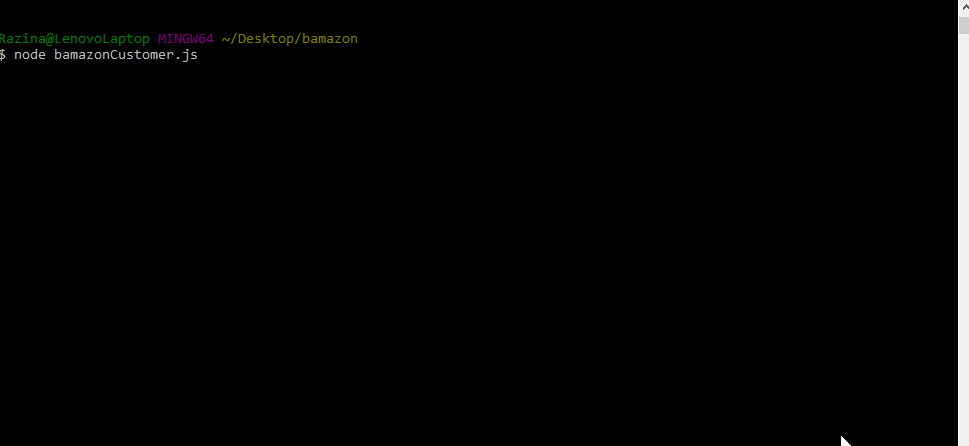
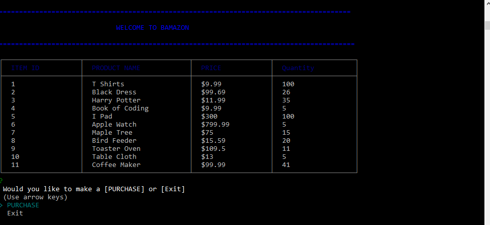
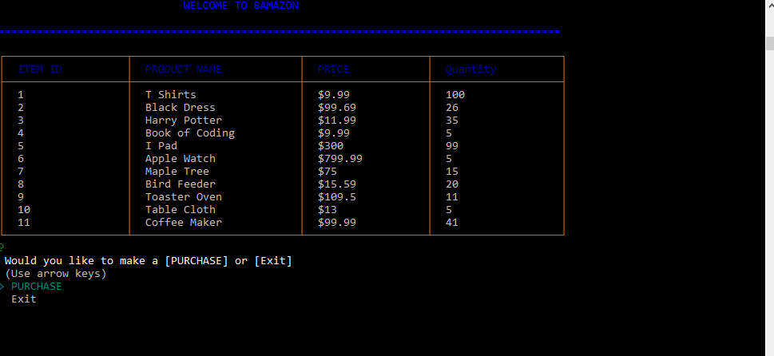
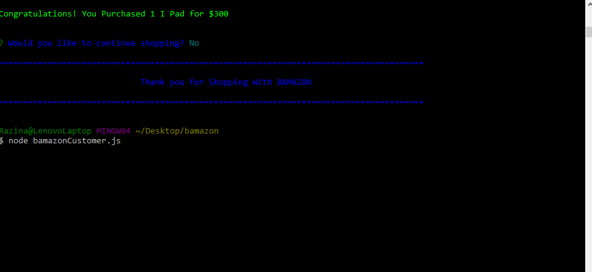

# **Bamazon is an Amazon look alike storefront.**

## About Bamazon
 The app will take in orders from customers and deplete stock from the store's inventory. Using Node.js & MySQL. The app has a customer viewpoint and a manger's viewpoint.

## User Instructions.
1. Be sure to clone the git project.
2. Run npm install from the console to make sure you get all the required dependencies
3. Add add the following to your root directory .env file:
    ### Sever Connection
    ..SERVER_USER = 'your_mysql_user_name_here'
    ..SERVER_SECRET = 'your_mysql_password_here'

4. Install the following:

    1. **MySQL NPM Package**
     [MySQL NPM Package](https://www.npmjs.com/package/mysql)

    2. **/MySQL Workbench Documentation**
        * [MySQL Workbench Documentation](http://dev.mysql.com/doc/workbench/en/)

    3. **MySQL Workbench Installation**
        * [MySQL Workbench Installation](https://dev.mysql.com/downloads/workbench/)

## Functionality.
    What Bamazon does and what to input
---
## __Customer View.__

From the command line, run ``node bamazonCustomer.js``

The user will be presented with a table of the current inventory for purchase from Bamazon, and prompted to purchase an item or exit.

| Operation | Result |
| :-----:   | :---:  |
|Welcome|
|Purchase|
|Invalid Product ID or Quantity| 
|Exit|

---

## __Manager View.__
From the command line, run ``node bamazonManager.js``

The user is presented with the following options:

| Operation | Result |
| :-----:   | :---:  |
|View Products for Sale|
|View Low Inventory| 
|Add to existing product| 
|Add new product| |

---

##Technologies Used:
* MySQL Workbench
* nodeJS

## Hope You Enjoyed shopping at Bamazon!
